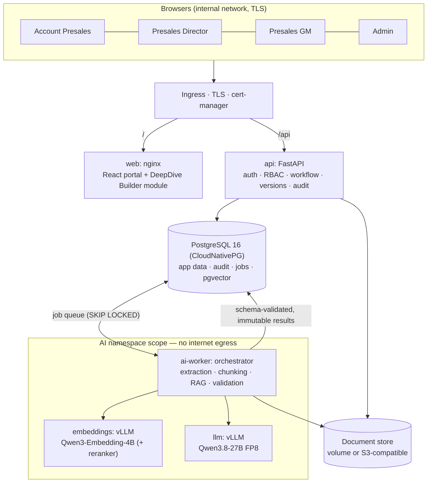
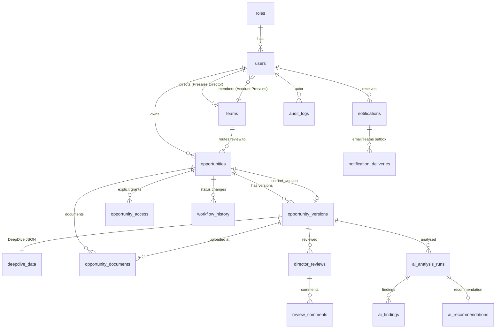
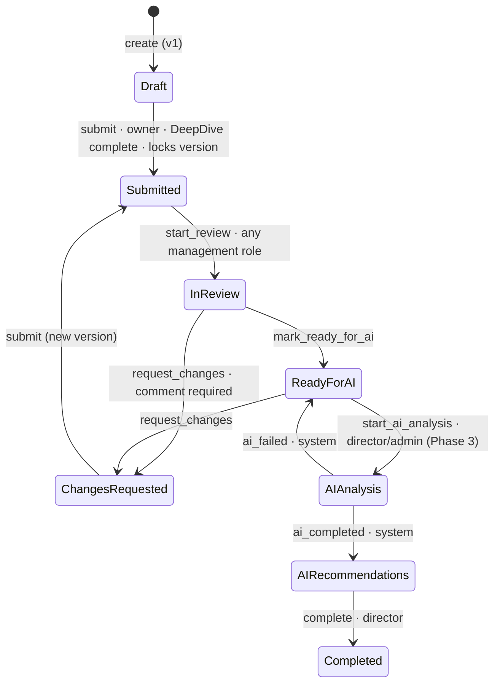
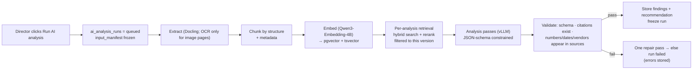

# Presales DeepDive Portal — Architecture

solutions by stc · Presales · Version 1.0 (Phase 1 delivered) · September 2026

This document covers the 12 items requested before implementation: assessment, target architecture, stack, data model,
RBAC, workflow, AI/RAG design, model choice for the RTX PRO 6000, Kubernetes on Rancher, UI map, migration and phases.
Phase 1 code accompanies it in this repository.

---

## 1. Assessment of the existing DeepDive Builder

**What it is.** A single self-contained HTML file (~630 KB) that works offline. Three parts lived inside it:

| Part | Size | Responsibility |
|---|---|---|
| Form application | ~650 lines JS + 10 KB CSS | 8-step wizard, field definitions, validation, reorder controls, autosave (localStorage), open/save draft |
| Generator (`deck.js`) | ~430 lines | Pure functions: `buildDeck` (pptxgenjs), `planStakeholders`, `embedData`/`readEmbeddedData`, `buildTrackerXlsx`/`readTrackerXlsx` |
| Assets | inline | pptxgenjs + JSZip bundles, 29 base64 icons |

**Strengths worth keeping.**
- Field model and validation already encode presales rules (required fields, character limits, conditional justification, line limits).
- The generator is cleanly separated and side-effect free, so it can run in any host.
- A generated PowerPoint embeds its own data (custom document properties), so decks round-trip back into the tool.
- The Excel tracker is a real Excel Table with dropdowns and conditional formatting, so it's importable.
- Strong brand fidelity and a UX users already accept.

**Limits for an enterprise portal.**
- No identity, permissions, or server-side persistence (drafts live in one browser's localStorage).
- No versioning or audit trail; a re-downloaded deck silently replaces the previous one.
- Validation exists only in the browser, so it can be bypassed.
- One file mixes UI, data and generation, which makes team development and code review hard.
- No place for documents, reviews or AI results.

**Conclusion.** Keep the builder's logic intact and make it a module. Build identity, workflow, versioning, audit and AI
*around* it, with the server as the source of truth and server-side validation mirroring the builder's rules.

---

## 2. Target architecture



Design principles:

1. **The server is the source of truth.** The builder edits a version; the API stores, validates, versions and audits it.
2. **Permissions are enforced twice.** A role permission check on every route, plus object scoping on every query.
3. **Governance lives in the database.** Triggers make audit logs append-only, finished AI runs immutable, and submitted versions unchangeable, even against bugs or ad-hoc SQL.
4. **Data never leaves the cluster.** No component calls a public AI service; NetworkPolicies deny internet egress; models load from local volumes in offline mode.
5. **Fewer moving parts.** PostgreSQL covers relational data, the job queue and vectors until scale proves otherwise.

---

## 3. Technology stack (with evaluation of the proposed options)

| Concern | Choice | Why — and what was rejected |
|---|---|---|
| Backend API | **Python 3.12, FastAPI, SQLAlchemy 2, Alembic, Pydantic 2** | Same language as the AI/document stack, so models, validation and extraction share code. Typed, fast, OpenAPI out of the box. |
| Auth | **Argon2id + short-lived JWT in an HttpOnly, SameSite=Strict cookie + CSRF double-submit** | Tokens are never readable by JavaScript (unlike localStorage JWTs). Token version per user revokes sessions on disable/reset. **Next:** OIDC with Entra ID / ADFS via Keycloak, keeping local accounts as break-glass. |
| Frontend | **React 18 + TypeScript + Vite**; builder as an ES module in a same-origin iframe | Typed, maintainable portal; builder logic reused unchanged and isolated from portal CSS/JS. The same source still produces the offline single-file builder. |
| Database | **PostgreSQL 16 on CloudNativePG** | HA, failover, PITR backups to S3, rolling updates, runs well on Rancher. |
| Vector store | **pgvector in the same PostgreSQL** — *not* a dedicated vector DB | Retrieval is always filtered to one opportunity version (thousands of chunks, not billions). pgvector keeps vectors transactional with RBAC and metadata, supports hybrid search with PostgreSQL full-text, and removes a system to secure and back up. Revisit Qdrant/Milvus only for >10–50M vectors or cross-opportunity semantic search at scale. |
| Queue | **PostgreSQL job table (`SELECT … FOR UPDATE SKIP LOCKED`)** — *Redis not required* | Enqueueing in the same transaction as the status change means no lost or phantom jobs. AI volume is tens of runs per day. Redis can be added later for caching/rate limits; it is not needed for correctness. |
| Object storage | **Mounted volume by default, S3-compatible optional** (one interface, `app/services/storage.py`) | MinIO works, but **check its current licence (AGPLv3) and the reduced community edition** with your legal team. Alternatives: Ceph RGW via Rook (if you run Ceph), SeaweedFS, or an existing enterprise S3 appliance. The code only depends on the S3 API. |
| LLM serving | **vLLM** | OpenAI-compatible API, continuous batching, prefix caching (the same RFP context is reused across analysis passes), and **structured outputs constrained by JSON Schema**, which is the backbone of the anti-hallucination design. SGLang is a credible alternative; the orchestrator talks to an OpenAI-compatible endpoint so either works. |
| LLM | **Qwen3.8-27B (FP8)** — see §8 | Newer and more capable than Qwen3-32B, and fits one 96 GB GPU with long context. |
| Embeddings | **Qwen3-Embedding-4B** (1024-dim Matryoshka), **BGE-M3** as fallback; **Qwen3-Reranker** | Strong multilingual retrieval; decide with an Arabic/English bake-off on your own RFPs (§7). |
| Document extraction | **pypdf, python-docx, python-pptx, openpyxl** (implemented); Docling optional later for complex layouts and tables | Native text with page, slide, sheet and numbered-section provenance, no heavyweight dependencies. Pages without a text layer are reported, never guessed at. OCR is not enabled in this deployment. Avoid PyMuPDF unless its AGPL licence is acceptable. |
| Malware scanning | **Not deployed** (by request) | Uploads are still restricted by extension, size and content signature, and stored outside the web root. `opportunity_documents.scan_status` records "skipped", so a scanner can be added later without a schema change. |
| Observability | Rancher Monitoring (Prometheus/Grafana), Loki, vLLM `/metrics` | Request IDs flow from API to audit logs. |

---

## 4. Database schema and ERD

18 tables, one Alembic migration (`backend/alembic/versions/0001_initial_schema.py`). All timestamps are `timestamptz`.



Key tables (full column list in `backend/app/models/`):

| Table | Purpose and key columns | Important constraints / indexes |
|---|---|---|
| `users` | username, full_name, email, password_hash (Argon2id), role_id, team_id, is_active, must_change_password, token_version, failed_login_count, locked_until | unique `lower(username)` |
| `roles` | 4 seeded roles | check constraint on key |
| `teams` | name, director_id | a director leads at most one team |
| `opportunities` | opportunity_number, title, account_name, status, owner_id, team_id, current_version_id, ai_readiness, has_critical_findings | unique number; indexes on status, owner, team, `lower(account_name)`, updated_at |
| `opportunity_versions` | version_number, based_on_version_id, change_notes, is_locked, locked_at, submitted_at, **revision** (optimistic concurrency), created_by/updated_by | unique (opportunity, version_number) |
| `deepdive_data` | version_id (1:1), schema_version, data JSONB, content_sha256 | **trigger: immutable once the version is locked** |
| `opportunity_access` | explicit read grants with expiry | |
| `workflow_history` | action, from_status, to_status, actor_id, version_id, comment | index (opportunity, time) |
| `opportunity_documents` | category, file name/extension/MIME, size, sha256, storage_key, **logical_document_id + doc_version**, scan_status, extraction_status, uploaded_by/at, soft delete | partial index on active documents |
| `director_reviews` / `review_comments` | decision per version; comments typed (general, section, critical issue, missing info, required action) with priority, owner, due date, status | unique (version, reviewer) |
| `ai_analysis_runs` | version_id, triggered_by, status, llm_model + revision, embedding_model, prompt_version, output_schema_version, input_manifest (document hashes, review ids, DeepDive hash), result_json, result_sha256, validation_errors, tokens | **trigger: no update/delete once finished** |
| `ai_findings` | section, category, severity, **evidence_class** (fact / director_observation / ai_inference / missing_information), finding, evidence, business_impact, recommended_action, suggested_owner, citations JSONB | **trigger: immutable once run finished** |
| `ai_recommendations` | overall_readiness, confidence, readiness_areas, required_actions, missing_information, management_recommendation | same |
| `notifications` / `notification_deliveries` | in-portal notifications; outbox for email/Teams | partial index on unread |
| `audit_logs` | actor, action, outcome, entity, opportunity, IP, user agent, request_id, details | **trigger: append-only** |

Phase 3 adds `document_chunks` (opportunity_id, version_id, document_id, page/slide/sheet, section path, chunk text,
`vector(1024)` with an HNSW index, `tsvector` for hybrid search) and `ai_jobs`.

---

## 5. RBAC matrix

Enforced in `backend/app/core/rbac.py` (permissions) and `backend/app/services/access.py` (which records).

Roles: **Presales GM**, **Portfolio Presales Director**, **Portfolio Presales Manager**, **Presales Account**, plus the
technical **Admin**. The three management roles share one permission set in this phase and stay separate in the model,
so a narrower scope can be introduced later without a migration.

| Capability | Admin | Presales GM | Portfolio Director | Portfolio Manager | Presales Account |
|---|:-:|:-:|:-:|:-:|:-:|
| Create/edit/disable users, assign roles | ✅ | — | — | — | — |
| Manage portfolios (Director + Manager + members) | ✅ | — | — | — | — |
| View audit log | ✅ | — | — | — | — |
| Configure AI settings / model endpoint | ✅ | — | — | — | — |
| View opportunities | All | All | All | All | Own + explicit grants |
| Create opportunity | — | — | — | — | ✅ |
| Edit DeepDive (open version) | — | ✅ | ✅ | ✅ | Owner |
| Open a new version | — | ✅ | ✅ | ✅ | Owner |
| Close / reopen an opportunity | ✅ | ✅ | ✅ | ✅ | — |
| Upload / delete documents (before submission) | — | — | — | — | Owner |
| View documents | ✅ | ✅ | ✅ | ✅ | Own |
| Submit to Review | — | — | — | — | Owner |
| Start review / comment / request changes / ready for AI | — | ✅ | ✅ | ✅ | — |
| Run AI analysis | ✅ | ✅ | ✅ | ✅ | — |
| View AI status & recommendations | ✅ | ✅ | ✅ | ✅ | Own |
| Modify review comments or AI results | — | Own comments | Own comments | Own comments | — |
| Delete a never-submitted draft | ✅ | ✅ | ✅ | ✅ | Own |
| Archive / restore a submitted opportunity | ✅ | ✅ | ✅ | ✅ | Own |
| Purge an archived opportunity for good | ✅ | — | — | — | — |
| Management dashboard (Active / Awaiting review / Ready for AI / Support Needed / Risks) | ✅ | ✅ | ✅ | ✅ | — |

Rules that make this real rather than UI hiding:
- Every opportunity query is scoped; records outside scope return **404**, so existence is not disclosed.
- Even with `opportunity.edit_own`, edits require ownership, an editable status and an unlocked current version.
- Workflow actors are checked per transition (owner, team director, system).
- Tests prove it: other presales → 404; other director → 404; GM or director writing → 403; missing CSRF → 403.

---

## 6. Opportunity workflow / state machine



Every transition, in one database transaction:
- validates the actor, the source status and the expected version;
- writes `workflow_history` (user, time, previous and new status, version, comment);
- writes `audit_logs`;
- creates notifications.

**What a version contains.** The Overview is the master record and belongs to the opportunity, not to a version: it
always shows the latest information and is never copied. A version holds the four things that describe one round of work
— the **DeepDive**, its **documents**, the **review comments** written on it, and the **AI analyses** run against it.
One selector above the tabs chooses the version, and all four tabs follow it. A new version copies the DeepDive and
carries the documents forward (as rows pointing at the same stored bytes), starts an empty review, and becomes current.

**Editing rules.** A version that has been submitted is locked for everyone, which is what keeps review comments and AI
results tied to exactly what was reviewed. The way forward is a new version, which the owner, the Portfolio Presales
Manager or the Portfolio Presales Director can open; doing so during review returns the opportunity to Draft and records
who opened it. While a version is open, all four of them can edit it.

**Active and all.** "Active opportunities" is everything the team is still working on. Only a management role moves an
opportunity out of it, by closing it; closed work stays visible under all opportunities and can be reopened.

**Removing an opportunity.** A draft that was never submitted is deleted outright. Anything that has been submitted is
**archived** instead: it leaves every list and dashboard but keeps its versions, documents, comments and AI results, and
can be restored. Only an Admin can purge an archived opportunity, through the same deliberate purge path the governance
triggers recognise.

**Versioning rules.**
- Submitting locks the version.
- After changes are requested, the owner creates a new version: a copy with required change notes, linked by `based_on_version_id`.
- Director reviews, comments and AI runs reference a `version_id`, so they always describe exactly what was reviewed or analysed.
- If the opportunity changes after analysis, a new version gets a new AI run; old runs are never overwritten.

---

## 7. AI / RAG architecture

### 7.1 Pipeline



**Inputs are frozen at trigger time.** `input_manifest` records the DeepDive `content_sha256`, each document id + sha256,
and the review/comment ids. Re-running later on the same version is reproducible and auditable.

### 7.2 Document processing and chunk metadata

- Native text first (Docling for layout-aware PDF, DOCX, PPTX, XLSX; plain decoding for TXT).
- OCR runs **only** for pages without a usable text layer (character-count and image-coverage heuristic), with `ara+eng`.
- Structure-aware chunking: split on headings, numbered clauses (“4.2”), slides, sheets and tables. Target 400–800 tokens with a small overlap. Tables are kept whole where possible, with the header row repeated.

Every chunk stores: `opportunity_id, version_id, document_id, document_name, category, document_type, page_number | slide_number | sheet_name, section_path ("4 › 4.2 Integration"), chunk_id, char offsets, sha256`.

Citations are generated from this metadata, never by the model: the model returns a `chunk_id`, and the portal renders
**“RFP.pdf — Page 37 — Section 4.2”**. A citation that points to a chunk not supplied to that call is rejected.

### 7.3 Analysis design (cross-checking, not summarising)

The LLM runs focused passes rather than one giant prompt, each with its own retrieval and JSON schema:

1. **Requirement extraction.** Mandatory requirements, deliverables, dates, compliance and SLA clauses from customer documents, each with a chunk citation.
2. **Coverage matrix.** Each requirement is compared against the DeepDive (scope, solution/deliverables, vendors, checklist): covered, partially covered, not covered, or contradicted.
3. **DeepDive claims check.** DeepDive statements are checked against the documents: supported, not found, or contradicted.
4. **Director comment analysis.** For each comment: addressed by the current DeepDive? Supported or contradicted by documents?
5. **Domain passes.** Partner/vendor readiness (uses the structured checklist, deal registration, pricing, internal-delivery justification), technical, commercial (**numbers only if present in sources**), competition and strategy, and risks.
6. **Synthesis.** Readiness areas with evidence, top critical findings, required actions, missing information, and the management recommendation. It uses only prior pass outputs and cannot introduce new facts.

### 7.4 Grounding and anti-hallucination controls

| Control | How |
|---|---|
| Evidence classes | Every finding must be `fact`, `director_observation`, `ai_inference` or `missing_information` (DB check constraint). |
| Facts need citations | `fact` without a valid chunk or DeepDive-field citation fails validation. |
| Director observations | Must cite a `review_comment_id`. |
| Missing information | Uses the exact phrase “Not found in the provided opportunity information.” |
| No invented values | Post-validation extracts money amounts, dates, vendor and competitor names from the output and requires each to appear in a cited source (normalised matching, Arabic and English numerals). Otherwise the item is downgraded to `ai_inference` with a warning, or rejected. |
| Constrained decoding | vLLM structured outputs with the JSON Schema; then Pydantic validation before saving. |
| Low temperature | 0–0.2 for extraction and checks; synthesis at 0.3. |
| Advisory framing | The recommendation schema includes a fixed disclaimer field; the UI states management makes the decision. |
| Evaluation harness | A golden set of past opportunities with known gaps; measure citation precision, requirement recall and unsupported-claim rate before each model or prompt change. `prompt_version` and model revision are stored on every run. |

The complete production system prompt and the full output JSON Schema (`executive_summary, overall_readiness,
confidence, critical_findings[], deepdive_gaps[], customer_requirement_gaps[], director_comment_analysis[],
technical_analysis, commercial_analysis, partner_analysis, risk_analysis[], missing_information[],
recommended_actions[], management_recommendation, citations[]`) are Phase 3 deliverables, versioned under
`backend/app/ai/prompts/` and tested against the golden set.

---

## 8. AI model recommendation for the RTX PRO 6000 (96 GB)

**Primary: Qwen3.8-27B, served by vLLM in FP8.**
- Apache 2.0 licence, released August 2026, with a native context of 262K tokens.
- In FP8 the weights take about 28 GB, leaving roughly 50 GB of KV cache on a 96 GB card at 0.82 utilisation. That comfortably serves long RFP contexts (128K) with batching across analysis passes.
- It is the strongest model that fits a single GPU without aggressive quantisation, and clearly ahead of Qwen3-32B, the older option you mentioned.
- Strong Arabic and English, which matters for mixed-language RFPs.

**Why not bigger.** Frontier open-weight models (Qwen3.8-Max, GLM-5.3, DeepSeek V4, Kimi K3) need multi-GPU servers or clusters. Squeezing a 70–120B model into 96 GB with 4-bit quantisation costs both context length and accuracy, which is the wrong trade for evidence-heavy document analysis.

**Alternatives to include in the bake-off.**
- A mixture-of-experts model in the ~30B-total / ~3B-active class, if throughput matters more than depth.
- The previous Qwen generation as a stability baseline.

**Embeddings: Qwen3-Embedding-4B, with BGE-M3 as the fallback.**
- Truncate Qwen3-Embedding-4B to 1024 dimensions (Matryoshka), so pgvector HNSW can index it.
- BGE-M3 remains a strong, lighter choice for Arabic retrieval.
- Add Qwen3-Reranker for the final top-k.
- **Decide with a two-week bake-off** on 20–30 of your real RFPs (Arabic, English, mixed). Measure requirement recall, citation precision and time per analysis.

**GPU sharing on one card.**
- LLM and embeddings run as two vLLM instances with explicit memory caps (0.82 / 0.08), shared through NVIDIA GPU Operator time-slicing.
- Ingestion embedding runs before analysis passes, so contention is small.
- MIG (supported on RTX PRO 6000 Blackwell) is the alternative if hard isolation is required, at the cost of splitting memory.

Pin model revisions, mirror weights into the internal registry or PVC, and run with `HF_HUB_OFFLINE=1`.

---

## 9. Kubernetes / Rancher architecture

Helm chart: `deploy/helm/presales-portal`.

| Workload | Kind | Notes |
|---|---|---|
| `web` | Deployment ×2 | nginx-unprivileged, strict CSP, read-only root FS |
| `api` | Deployment ×2 + PDB | readiness `/api/health/ready`, liveness `/api/health/live`, non-root, read-only root FS |
| `migrate` | Job (pre-install/pre-upgrade hook) | `alembic upgrade head` before new pods start |
| `db` | CloudNativePG `Cluster` ×3 | Longhorn storage, optional barman backups to S3 |
| `llm` | Deployment (GPU node) | vLLM + model PVC, offline mode — **Phase 3, disabled by default** |
| `embeddings` | Deployment (GPU node) | vLLM embedding task — Phase 3 |
| `ai-worker` | Deployment | orchestrator/ingestion — Phase 3 |
| ClamAV, S3 | Existing platform services or separate charts | Phase 2 |

**Security.**
- Secrets come from Kubernetes Secrets (Sealed Secrets or External Secrets recommended), never values files.
- TLS is terminated at the Ingress with cert-manager and your internal CA; session cookies are `Secure`.
- NetworkPolicies:
  - The namespace is deny-all by default.
  - The ingress controller may reach web and api only.
  - api, migrate and the AI worker may reach PostgreSQL only.
  - Only the AI worker may reach the model servers.
  - There is **no internet egress**.
- Pods run as non-root with `RuntimeDefault` seccomp, all capabilities dropped, and no service-account tokens.
- Images come from the internal registry and are pinned by tag (digest pinning recommended).

---

## 10. UI / page map

```
Login ─ Change password (forced on first sign-in)
└─ Portal shell (left navigation by role, notifications, sign-out)
   ├─ Dashboard ........................ one look for every role; responsive from 390 px upward
   │                                      management: 4 KPIs + Opportunity Attention Monitor (read-only table
   │                                      of every active opportunity, expandable per row)
   │                                      Presales Account: my work queue ("what do I need to work on?")
   ├─ Opportunities
   │  ├─ My / Team / All opportunities . filters: search, account, number, owner, director, status, dates, AI readiness
   │  ├─ Create opportunity ............ Account Presales
   │  └─ Opportunity workspace
   │     ├─ Overview ................... master record: never versioned, no version selector
   │     ├─ DeepDive ................... existing builder (editable or read-only), version selector, autosave
   │     ├─ Documents .................. Phase 2
   │     ├─ Review & Comments .......... Phase 2 (DeepDive · PowerPoint · Documents · Comments)
   │     ├─ AI Analysis ................ Phase 3
   │     ├─ AI Recommendations ......... Phase 3
   │     ├─ Versions ................... visual timeline with change notes
   │     └─ Workflow history ........... every transition: who, when, from → to, version, comment
   ├─ Reviews .......................... awaiting review / changes requested (Director, GM)
   ├─ AI Analytics / AI Recommendations  cross-opportunity views (Phase 3)
   └─ Administration (Admin) ........... Users · Teams · Audit log · AI settings (Phase 3)
```

---

## 11. Migration approach from the single-page builder

1. **Modularise without rewriting.** Done in Phase 1.
   - The HTML is split into `builder.html`, `styles.css`, `deck.js` (unchanged generator, now an ES module) and `app.js` (unchanged form logic plus a small bridge).
   - Vite builds both the portal module **and** the offline single-file `DeepDive_Builder.html` from the same source.
   - The existing Playwright regression suite passes against the modular build.
2. **Embed through a narrow bridge.** Portal ↔ builder uses same-origin `postMessage`:
   - `dd:load`, `dd:changed`, `dd:state`, `dd:request-state` and `dd:goto-review`;
   - origin and source are both checked.
   - In the portal, the builder hides *Load example* and *Clear*, locks the opportunity number, and turns read-only when required.
3. **Bring existing work in.** A presales user creates the opportunity, then uses the builder's **Open** on any PowerPoint the old builder produced; its embedded data loads straight into version 1. This path is covered by the end-to-end test. Bulk import of historical decks can reuse `readEmbeddedData` in a script.
4. **Keep the offline builder available** during transition (served at `/downloads/DeepDive_Builder.html`), then retire it once portal adoption is complete.
5. **Later (optional).** Port the builder form to React components step by step behind the same bridge contract, without a big-bang rewrite.

---

## 12. Implementation phases

| Phase | Scope | Status |
|---|---|---|
| **1. Foundation** | Auth (Argon2id, cookie JWT, CSRF, lockout, forced password change); RBAC and object scoping; users/teams/audit admin; opportunities with portal-owned number; versioning with optimistic concurrency; workflow through Ready for AI; in-portal notifications; dashboards for all roles with filters; builder integrated as a module; offline builder preserved; DB governance triggers; Docker, Helm | **Delivered** |
| **2. Documents & Director review** | Document storage (mounted volume or S3-compatible), upload with extension / size / content-signature validation, document versions, delete before submission, audited downloads; Review & Comments screen with structured comments (general, by section, critical issue, missing information, required action) carrying priority, owner and due date, comment status tracking, decisions per version | **Delivered** (malware scanning intentionally not included — `scan_status` is recorded as "skipped" and the integration point stays in the schema) |
| **3. AI engine** | Ingestion (PDF, DOCX, PPTX, XLSX, TXT, CSV with page/slide/sheet/section provenance), structure-aware chunking, pgvector + full-text hybrid retrieval scoped to one version; PostgreSQL job queue and worker; production system prompt + JSON Schema + schema-constrained decoding; grounding validation (citations, invented numbers/dates/entities); immutable runs; AI Analysis and Recommendations screens with one-click evidence | **Delivered** (engine, screens and a no-GPU demo analyst; the vLLM model deployment, reranking and the evaluation harness remain) |
| **4. Hardening & scale** | SSO (Entra ID/ADFS), retention jobs, backup/restore drills, load and security testing (OWASP ASVS L2), executive analytics, observability dashboards | Ongoing |
